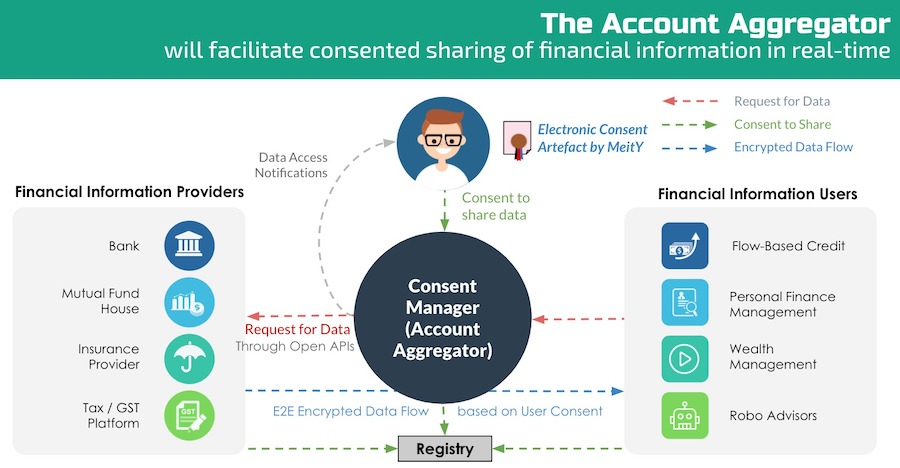

  
  <h1 align= "center">Finity</h1>
  <h2 align= "center">Trade Made Easy</h2>
  

There is currently a gap in trust between financial services platforms and the users, both in the personal finance space and business space.
We aim to bridge the gap with our platform which covers a full suite of financial services both for individuals and businessmen.

## Solution Highlights  
* ### Flow Based Credit Facilitation: 
Facilitating users with collateral-free lAutomatic recovery of credited funds from the borrower to the lender by splitting up the earning on every transaction loans.

* ### Automatic transaction-based credit remittance
Automatic recovery of credited funds from the borrower to the lender by splitting up the earning on every transaction.

* ### Finance and logistical solutions to individuals as well as businesses
Personal finance for individuals and Business solutions for MSMEs.

## Resources 
* ### Account Aggregator Framework:
 
 
 The Account aggregator framework helps multiple finacial institutions to share data beteween themselves without compramising security thus commodotising user's finacial data.

* ### RazorPay Invoice API:
* ### Razorpay Route API
* ### Razorpay Items API

## Consumer Side 

# Team

 * ### Devansh Swarup 
        
 * ### Dhruv Upadhyay
        
 * ### Shobit Puri 
        
* ### Aryan Pandey 
        

